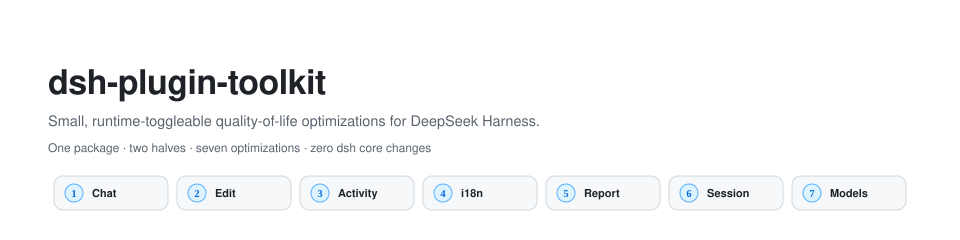
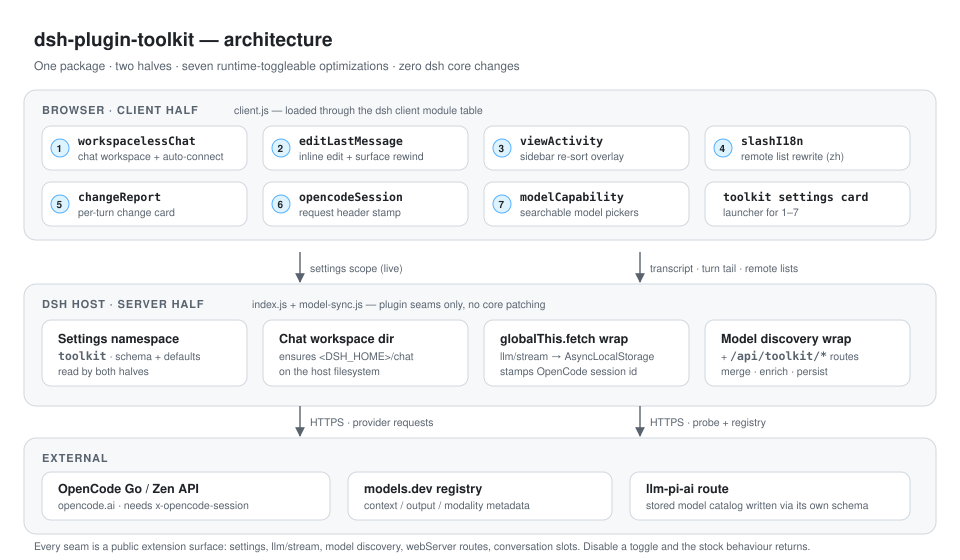
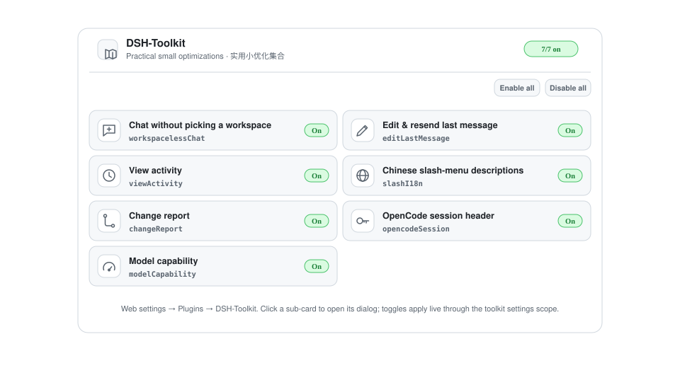
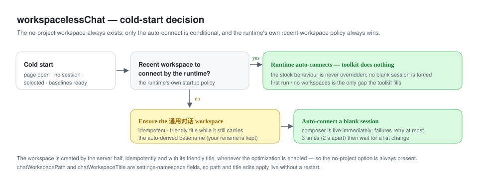
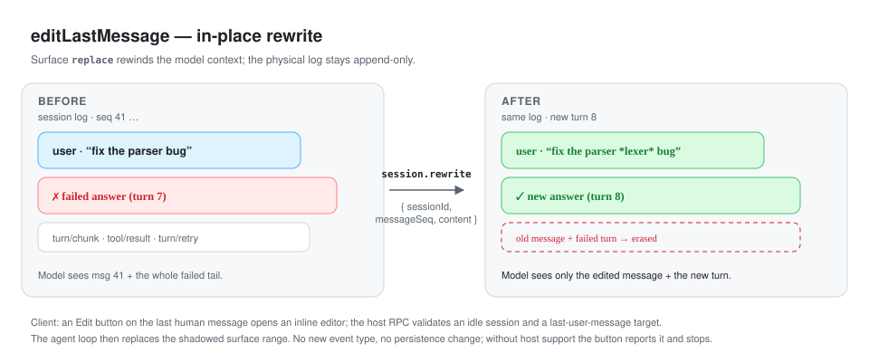
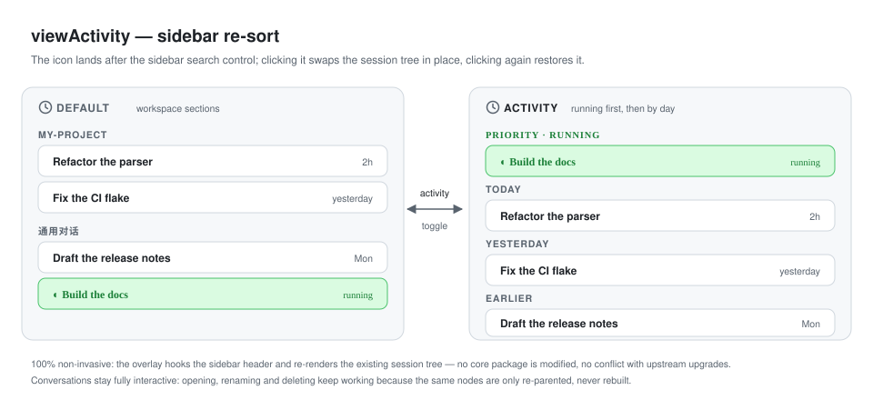
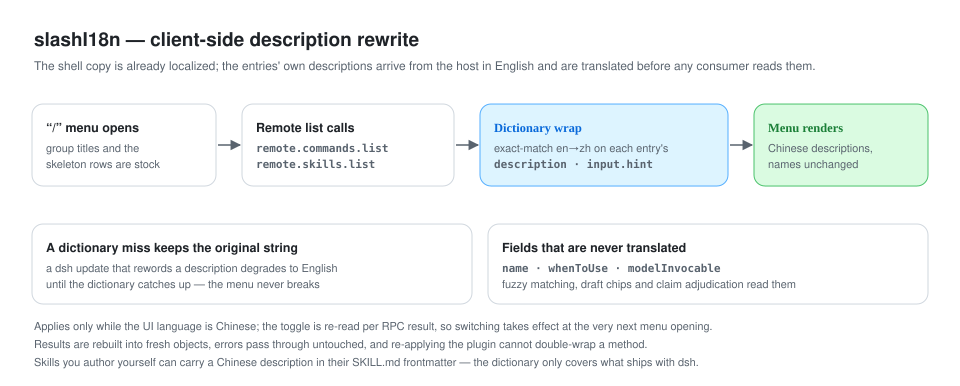
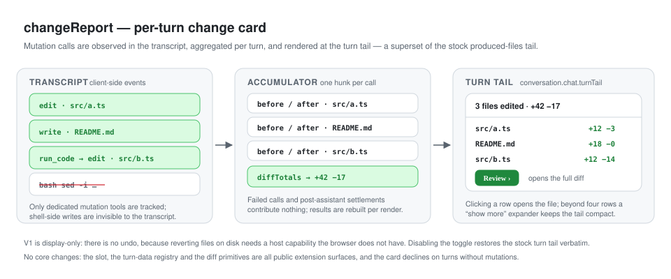
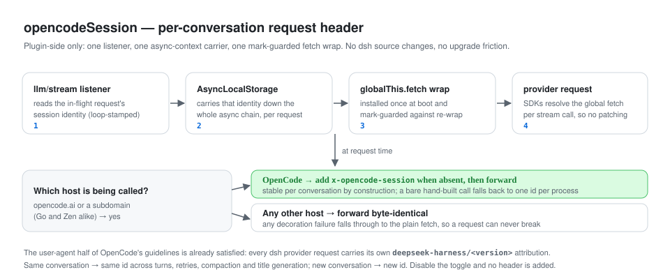
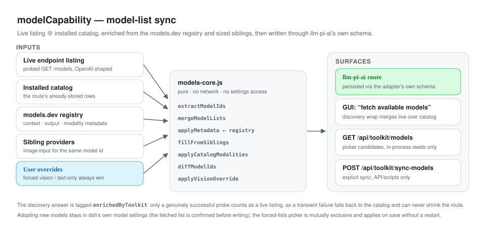

<p align="center">
  
</p>

<p align="center">
  <b>English</b> · <a href="README_CN.md">简体中文</a>
</p>

Personal quality-of-life toolkit for [DeepSeek Harness](https://github.com/deepseek-ai/deepseek-harness). Each optimization is too small to deserve its own vertical plugin, so they ship together as one entry in the Toolkit settings card: **Web settings → Plugins → DSH-Toolkit** expands a half-width sub-card grid (icon, title, short subtitle, on/off badge), and clicking a sub-card opens that optimization's dialog. The plugins page stays a compact launcher as the list grows.

Everything is wired through public extension surfaces — settings namespaces, the client module table, conversation slots, `llm/stream`, model discovery and `webServer` routes — so no dsh core package is patched and upstream one-click upgrades stay painless.

## Contents

- [At a glance](#at-a-glance)
- [Install](#install-web-profile)
- [Architecture](#architecture)
- [The settings card](#the-settings-card)
- [Optimizations](#optimizations)
  - [`workspacelessChat`](#workspacelesschat)
  - [`editLastMessage`](#editlastmessage)
  - [`viewActivity`](#viewactivity)
  - [`slashI18n`](#slashi18n)
  - [`changeReport`](#changereport)
  - [`opencodeSession`](#opencodesession)
  - [`modelCapability`](#modelcapability)
- [Configuration reference](#configuration-reference)
- [Development](#development)
- [Graduation rules](#graduation-rules)
- [Model experience](#model-experience)
- [License](#license)

## At a glance

| # | Optimization | What it does | Default | Half |
|---|---|---|---|---|
| 1 | [`workspacelessChat`](#workspacelesschat) | Keeps a no-project chat workspace and auto-connects it at cold start | on | client + host |
| 2 | [`editLastMessage`](#editlastmessage) | Edit-and-resend the last user message, rewinding the model context | on | client |
| 3 | [`viewActivity`](#viewactivity) | Sidebar activity icon: running-first, then Today / Yesterday / Weekday / Earlier | on | client |
| 4 | [`slashI18n`](#slashi18n) | Chinese descriptions for the `/` menu's commands and skills | on | client |
| 5 | [`changeReport`](#changereport) | Codex-style per-turn file-change card at the turn tail | on | client |
| 6 | [`opencodeSession`](#opencodesession) | Stable `x-opencode-session` header on OpenCode Go/Zen requests | on | host |
| 7 | [`modelCapability`](#modelcapability) | Keeps one llm-pi-ai route's model list, capacities and image support current | on | host + client |

## Install (web profile)

```sh
cd ~/.dsh/profiles/web
pnpm add file:/path/to/dsh-plugin-toolkit   # link:/path/to/dsh-plugin-toolkit while developing
# add "dsh-plugin-toolkit" to the dsh.profile.bundles list in package.json
systemctl restart deepseek-harness.service  # or your profile's restart path
```

Server-side changes (this package) need a profile restart; the client bundle re-syncs with `pnpm install` inside the profile followed by a browser hard refresh. Toggles, paths and model lists are settings-namespace values, so day-to-day edits apply live without a restart.

## Architecture

<p align="center">
  
</p>

The package is split into a browser half and a host half; both read the same `toolkit` settings namespace, and neither touches dsh source.

| Half | Files | Responsibility | Seams used |
|---|---|---|---|
| Client | `client.js` | Settings card, inline edit UI, sidebar re-sort, `/`-menu rewrite, change-report card, model-id pickers | Client module table, conversation node/turn-tail slots, `remote.*` namespace wraps, settings scope |
| Host | `index.js` | Settings schema and defaults, default chat workspace directory, OpenCode session-header stamping | `settings`, `llm/stream`, `globalThis.fetch` |
| Host | `model-sync.js` + `models-core.js` | Model discovery wrap, sync/listing routes, capacity and modality enrichment | `llm` model discovery, `webServer` routes, settings stores |

Design rules that hold across the package:

- **No core patches.** Every hook is a documented extension surface, so an upstream upgrade cannot conflict with the toolkit.
- **Dormant, not broken.** Missing a seam (older host, no `webServer`, no `session.rewrite`) disables just that optimization; the rest of the UI is untouched.
- **Live configuration.** Every toggle and field lives in the `toolkit` settings namespace and is re-read at use time.
- **Independent toggles.** Each optimization can be switched off from its sub-card and restores the stock behaviour verbatim.

## The settings card

<p align="center">
  
</p>

The card renders one sub-card per optimization with a live on/off badge and an **Enable all / Disable all** pair. Opening a sub-card shows that optimization's own description and fields (for example the chat directory, or the model-capability key and pickers).

## Optimizations

### `workspacelessChat`

Chat without picking a workspace first, like other agent harnesses' default-project behaviour. dsh's composer requires a blank session to belong to a workspace, so the optimization keeps a dedicated **no-project chat workspace** (「通用对话」) around: it is idempotently created with its friendly title whenever the optimization is enabled, so the option always shows in the sidebar and workspace picker — open it to chat without a project.

On top of that, when both baselines are ready, no session is selected, and the runtime's own startup policy has no recent workspace to connect (first run, no workspaces), the client also auto-connects a blank session in that workspace so the composer is live immediately.

<p align="center">
  
</p>

The cold-start auto-connect failures retry at most 3 times (2 s apart) and then stay dormant until a list change re-triggers the check. The runtime's own recent-workspace auto-connect always wins; the auto-connect only fills the nothing-to-connect case, while the workspace itself exists unconditionally. The workspace is renamed to its friendly title only while it still carries the auto-derived basename (a title you set yourself is never overwritten).

| Config | Default | Meaning |
|---|---|---|
| `optimizations.workspacelessChat` | `true` | Toggle the no-project chat workspace + auto-connect. |
| `chatWorkspacePath` | `""` | Host directory for the default chat workspace; empty resolves to `<DSH_HOME>/chat`. The server creates the directory (live on settings edits, too). |
| `chatWorkspaceTitle` | `通用对话` | Display title of the no-project chat workspace. |

The card writes go through the `toolkit` settings namespace, so toggles and path edits apply live without a restart.

### `editLastMessage`

Retry a failed answer without copy-pasting and without polluting the model's context: the last user message's hover actions gain an **Edit** button. Clicking it opens an inline editor prefilled with that message; **Save & resend** rewrites the session in place — the edited message and everything after it are replaced (the model context truly rewinds, so the next request contains only the edited content), and a new turn answers the edited message.

<p align="center">
  
</p>

This needs host support for the `session.rewrite` RPC (a small addition to this repo's dsh checkout). On hosts without it, the button still shows but reports that rewriting is unsupported. The client transcript erases the old message and its failed turn; turn boundaries are kept so the failed turn collapses into an invisible empty turn. Requires an idle session (a running turn rejects with `agent-busy`); only the last human user message is editable, text-only.

| Config | Default | Meaning |
|---|---|---|
| `optimizations.editLastMessage` | `true` | Edit-and-resend button on the last user message. |

### `viewActivity`

Adds an **Activity** icon (native clock glyph) to the workspace sidebar, right after the search (magnifier) control. Clicking it **re-sorts the sidebar's conversation list in place**: running conversations surface in a leading **Priority** group, then the remaining history grouped by **Today / Yesterday / Weekday / Earlier** (newest first within each group) — the familiar "recent conversations" pattern. Clicking again restores the previous grouping (workspace sections or the flat list); the icon highlights while the activity sort is on.

<p align="center">
  
</p>

> 100% non-invasive external implementation: hooks the activity toggle into the sidebar header and dynamically swaps the session tree, with zero modifications to official DSH core packages and zero conflict with upstream one-click upgrades.

| Config | Default | Meaning |
|---|---|---|
| `optimizations.viewActivity` | `true` | Workspace-header activity icon + in-place running-first / by-day re-sort. |

### `slashI18n`

The `/` menu's shell copy (group titles, the user-only badge, skeleton rows) is already localized, but the entries' descriptions come straight from the host: built-in command descriptions, argument hints, and skill catalog descriptions all render verbatim in English, even under the Chinese UI. This optimization translates them **client-side**: the toolkit wraps the `remote.commands.list` and `remote.skills.list` namespace methods and rewrites each response's `description` / `input.hint` through an exact-match en→zh dictionary before any consumer reads it.

<p align="center">
  
</p>

Scope and safety rails:

- `name` fields are never translated — fuzzy matching, the draft-chip lexicon, and claim adjudication all read them; `whenToUse` / `modelInvocable` ride untouched too.
- A dictionary miss falls back to the original string, so a dsh update that rewords a description degrades to English until the dictionary catches up (it never breaks the menu).
- Translations apply only while the UI language is Chinese, and the settings toggle is re-read per RPC result, so switching takes effect at the very next menu opening.
- Results are rebuilt into fresh objects, so no caller cache aliases the wire data; rejections and error results pass through untouched; re-applying the plugin cannot double-wrap a method.
- Skills you authored yourself can simply carry a Chinese `description` in their `SKILL.md` frontmatter — no dictionary needed. The dictionary only covers what ships with dsh (6 built-in commands, 2 hints not already keyed by ui-conversation's own `hint.*` locale keys, and the 2 built-in skills).
- No dsh source changes and no host extension are required; on a host without these namespaces the optimization simply stays dormant.

| Config | Default | Meaning |
|---|---|---|
| `optimizations.slashI18n` | `true` | Chinese descriptions for the `/` menu's commands and skills. |

### `changeReport`

A codex-style change report at the tail of every completed turn. When a turn changed files (`edit` / `write` / mutating `str_replace_editor` calls), the tail renders a compact card: **"N files edited · +A -R"**, one row per file with its own `+N -M` (click a row to open the file in the viewer), a *show more* expander beyond four rows, and a **Review** button opening the turn's full diff. The card is a superset of dsh's built-in produced-files tail: it joins the same `conversation.chat.turnTail` chain ahead of it (lower priority) and declines on non-mutating turns, so the stock tail renders exactly as before.

<p align="center">
  
</p>

How it works, and its bounds:

- Data comes from the transcript, client-side: a conversation turn-data accumulator records one before/after hunk per successful mutation call — direct agent tool calls **and** `run_code`'s nested sub-calls (which log as `tool/code-dispatch` events keyed by their root call). Line counts reuse the primitives' `diffTotals`, so the header numbers always match what the review `DiffBlock` renders.
- `bash`-side file writes (sed, redirects, …) are invisible to the transcript and therefore not tracked — the report covers the dedicated file-mutation tools, like codex tracks its own.
- Failed calls (tool error results) contribute nothing; settlements after the closing assistant seq are excluded; aggregated results are rebuilt per render (no aliasing with the wire data).
- No **undo**: reverting files on disk would need a host-side capability the browser does not have. Declining is deliberate — V1 is display-only.
- No dsh source changes: the slot, the turn-data definition registry, and the diff primitives are all public extension surfaces. Disabling the toggle restores the stock tail verbatim.

| Config | Default | Meaning |
|---|---|---|
| `optimizations.changeReport` | `true` | Per-turn change report card at the turn tail. |

### `opencodeSession`

OpenCode Go now 400-rejects requests that lack `x-opencode-session` (`{"type":"MissingSessionID", ...}`), and its guidelines ask coding agents to identify themselves with their own user agent and to send one stable session id per conversation so the gateway can route requests and reuse prompt caches. The user-agent part is already satisfied — every dsh provider request carries `deepseek-harness/<version>` attribution. This optimization fixes the session half, entirely from the plugin side: an `llm/stream` listener carries the in-flight request's session identity down the async chain via `AsyncLocalStorage`, and a thin boot-time `globalThis.fetch` wrap stamps the header onto any request whose target host is `opencode.ai` or a subdomain (Go and Zen alike).

<p align="center">
  
</p>

How it works, and its bounds:

- The id is the loop-stamped session identity dsh already attaches to every request it builds (the agent-loop invariant requires it), so the header is stable per conversation by construction — new conversation, new id; same conversation, same id across turns, retries, compaction, and title generation.
- A call that carries no session identity (rare hand-built one-shots; also model discovery) falls back to one id per process rather than failing with the gateway's `MissingSessionID`.
- The wrap is installed once (mark-guarded), adds the header only when it is absent, and any decoration failure falls through to the plain fetch — it can never break a request. Non-OpenCode requests pass through byte-identical.
- Provider SDKs resolve the global fetch per request (pi-ai constructs its client per stream call), so the boot-time wrap needs no dsh source changes and survives one-click upstream upgrades untouched.
- 100% non-invasive external implementation, like `viewActivity`: zero modifications to dsh core packages.

| Config | Default | Meaning |
|---|---|---|
| `optimizations.opencodeSession` | `true` | Stable per-conversation `x-opencode-session` header on OpenCode Go/Zen requests. |

### `modelCapability`

Keeps one llm-pi-ai route's model list (default `opencode-go`) current against the endpoint's live listing: newly served models become selectable immediately, with no restart; missing context/output limits are filled from the [models.dev](https://models.dev) registry and from sized siblings; image input is borrowed from any other registered provider that declares the same id multimodal; and a model can be forced vision-capable or text-only. This was the 「模型能力」 section of `dsh-plugin-quota-badges` and now lives here in full — the other plugin no longer ships it.

<p align="center">
  
</p>

How it works, and its bounds:

- **Discovery wrap**: wraps the runtime's llm-pi-ai model discovery so the GUI's "fetch available models" answers with the live listing merged over the installed catalog instead of the catalog alone. The wrap is tagged `enrichedByToolkit`: only an answer whose probe really succeeded counts as a live listing for the sync route, so a transient probe failure falls back to the catalog and can never shrink the stored route. There is **no "sync model list" button on the card**: adopting new models happens in dsh's own model settings (click "fetch available models"; the list is yours to confirm before it is written), so nothing dumps the whole live listing into the route by accident. The server route that does it — `POST /api/toolkit/sync-models` — stays registered and only runs when explicitly called (API/scripts).
- **Searchable model pickers**: the forced vision / text-only fields are no longer comma-separated id boxes. Each is a type-to-filter picker over the route's known models — click a candidate to add it as a chip, click the chip's × to drop it, press Enter to add an id the list does not know, Backspace to delete the last chip. Candidates come from `GET /api/toolkit/models` (the route's stored rows ∪ the runtime's `listModels`, deduped and sorted, in-process reads only — no network) and are fetched once per dialog open: it only reads the configured models and changes nothing. The two lists are mutually exclusive: adding to one removes the id from the other.
- **Startup healing**: pre-writes the route's wire protocol (`api`) so the configuration surface's own save passes serviceability too, and heals image input on already-saved models (that save path sends no `input` field). Edits to the forced vision / text-only lists apply to the stored models at once — no restart, no re-sync.
- **One-way migration**: on first start with an empty `modelsApiKey`, the former `quota-badges` namespace donates its OpenCode key, forced vision / text-only lists, and route shape; the migration marker lands in the same write, so clearing the key afterwards is never re-filled.
- Dormant — not broken — on a host without the settings / llm / webServer seams, and everything stays inside this package: no dsh source changes.

| Config | Default | Meaning |
|---|---|---|
| `optimizations.modelCapability` | `true` | Master switch for the discovery wrap, sync route, and capability healing. |
| `modelsApiKey` | `""` | OpenCode API key; empty falls back to the environment variable. |
| `modelsApiKeyEnvVar` | `OPENCODE_API_KEY` | Environment variable consulted when the key is empty. |
| `modelsRouteKey` | `opencode-go` | The llm-pi-ai route kept current. |
| `modelsBaseURL` | `https://opencode.ai/zen/go/v1` | Endpoint probed for the live model listing. |
| `modelsRouteApi` | `openai-completions` | Wire protocol pre-written onto the route. |
| `modelsSyncPath` | `/api/toolkit/sync-models` | Same-origin explicit-sync route (no card entry point; API/scripts only; changing it needs a restart). |
| `modelsPath` | `/api/toolkit/models` | Same-origin route listing the picker's candidates (changing it needs a restart). |
| `modelsEnrichFromRegistry` | `true` | Fill missing capacities/modalities from the models.dev registry. |
| `modelsRegistryProvider` | `opencode-go` | Provider directory inside the models.dev registry. |
| `modelsVision` | `[]` | Model ids forced to accept image input. |
| `modelsTextOnly` | `[]` | Model ids forced to drop image input. |
| `modelsTimeoutSec` | `10` | Probe and registry request timeout in seconds. |

> Note: this optimization carries a server route and its own config fields, so it already meets the graduation rule below; it deliberately stays in the Toolkit for now as one numbered optimization.

## Configuration reference

All fields live in the `toolkit` settings namespace. The composition defaults are declared in `cordis.patch.yml`, the schema in `index.js`, and the public types in `index.d.ts`.

| Field | Type | Default | Used by |
|---|---|---|---|
| `optimizations.workspacelessChat` | boolean | `true` | workspacelessChat |
| `optimizations.editLastMessage` | boolean | `true` | editLastMessage |
| `optimizations.viewActivity` | boolean | `true` | viewActivity |
| `optimizations.slashI18n` | boolean | `true` | slashI18n |
| `optimizations.changeReport` | boolean | `true` | changeReport |
| `optimizations.opencodeSession` | boolean | `true` | opencodeSession |
| `optimizations.modelCapability` | boolean | `true` | modelCapability |
| `chatWorkspacePath` | string | `""` → `<DSH_HOME>/chat` | workspacelessChat |
| `chatWorkspaceTitle` | string | `通用对话` | workspacelessChat |
| `modelsApiKey` | string | `""` | modelCapability |
| `modelsApiKeyEnvVar` | string | `OPENCODE_API_KEY` | modelCapability |
| `modelsRouteKey` | string | `opencode-go` | modelCapability |
| `modelsBaseURL` | string | `https://opencode.ai/zen/go/v1` | modelCapability |
| `modelsRouteApi` | string | `openai-completions` | modelCapability |
| `modelsSyncPath` | string | `/api/toolkit/sync-models` | modelCapability |
| `modelsPath` | string | `/api/toolkit/models` | modelCapability |
| `modelsEnrichFromRegistry` | boolean | `true` | modelCapability |
| `modelsRegistryProvider` | string | `opencode-go` | modelCapability |
| `modelsVision` | string[] | `[]` | modelCapability |
| `modelsTextOnly` | string[] | `[]` | modelCapability |
| `modelsTimeoutSec` | number | `10` | modelCapability |

## Development

```sh
npm test          # node --test tests/*.test.js  (models-core, model-sync, settings-card)
npm run smoke     # host-side smoke checks for the plugin bundle
```

| Path | Contents |
|---|---|
| `index.js` / `index.d.ts` | Host half: settings namespace, chat directory, OpenCode fetch wrap. |
| `model-sync.js` | Host half: discovery wrap, sync/listing routes, enrichment and migration. |
| `models-core.js` | Pure merge/enrich/diff helpers (no network, no settings access). |
| `client.js` | Browser half: the settings card and every client-side optimization. |
| `cordis.patch.yml` | Composition defaults inserted into the dsh bundle patch. |
| `tests/` | Unit tests for the pure core, the sync route and the settings card. |
| `scripts/` | Smoke, e2e and verification scripts. |
| `docs/assets/` | The SVG diagrams used by this README family. |

## Graduation rules

An optimization graduates out of this package into its own `dsh-plugin-*` when any of these holds:

- it grows its own settings GUI beyond one toggle row, a service route, a background job, or a `client.js` feature surface;
- it needs to be enabled/disabled per composition row (Cordis toggles whole rows, not single tools);
- its definition plus tests exceed roughly 200 lines;
- it is worth publishing or sharing on its own.

## Model experience

No tool is registered and no prompt surface changes; this package is pure UI/runtime ergonomics. The one exception is the `editLastMessage` rewrite, which by design changes what the model sees: after an edit, the erased tail is removed from the derived request history (via the surface `replace`), so subsequent turns read only the edited content.

## License

[MIT](LICENSE)
